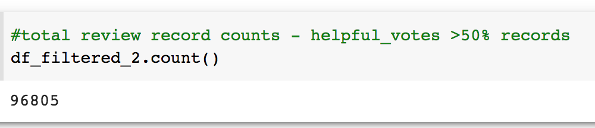
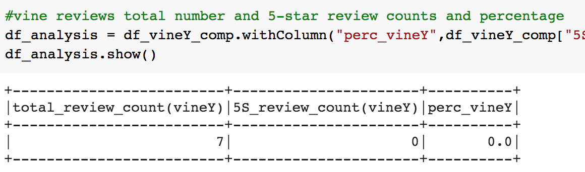
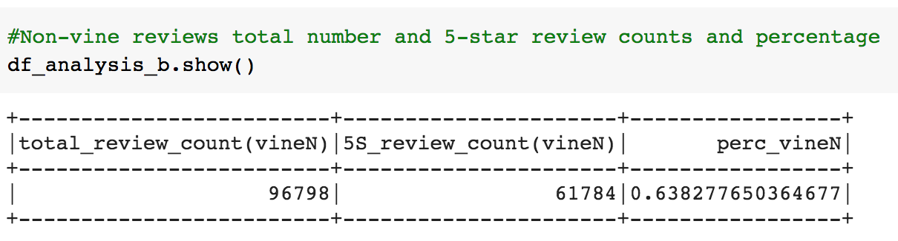
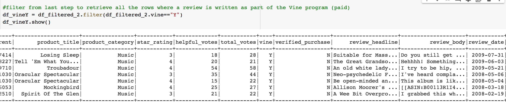
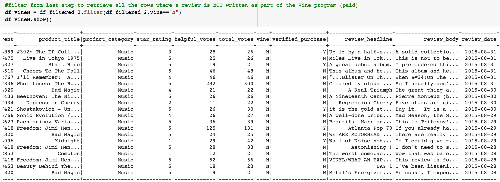

# Amazon_Vine_Analysis
## Part One - Overview
Amazon Vine is a program that enables a select group of Amazon customers to post opinions about new and pre-release items to help their fellow customers to make educated purchasing decisions ([see reference link](https://www.amazon.ca/gp/help/customer/display.html/?nodeId=GPEWN3RSQPEU2HST&pop-up=1)).

The analysis uses PySpark to perform ETL(Extract, Transform, Load) process on a selected dataset. The goal is to perform an analysis of the data to determine if there is a bias toward favorable reviews from Vine Members in the chosen dataset. 

Tools used: PySpark, Google Colab, AWS RDS, Postgres SQL
## Part Two - Results
From the analysis conducted with the dataset on [amazon reviews on us music](https://s3.amazonaws.com/amazon-reviews-pds/tsv/amazon_reviews_us_Music_v1_00.tsv.gz), the following results are concluded.

- There are in total 96805 reviews, among which 7 are vine reviews, and 96798 are non-vine reviews.
- None of the vine reviews were 5 stars, and 61784 of the non-vine reviews were 5 stars.
- The percentage of the vine reviews and non-vine reviews that were 5 stars are 0% and 64% respectively.

    

    

    

Here are the display of dataFrames with the reviews for vine (total of 7) and non-vine (showing top 20 only) records:

- Vine Reviews records

    
- Non-Vine Reviews records (top 20 display)

    

## Part Three - Summary
In the chosen dataset and analysis, there is no positivity bias for reviews in the Vine Program. As can be seen from the above data, vine reviews have 0% of 5-stars review while non-vine reviews has 64% being 5-stars. Therefore there are more positive reviews outside of the Vine program.

An additional analysis that can be done is to have the percentage of above 3-stars reviews compared for vine and non-vine programs to see if the vine reviews have a positive bias. 

Furthermore, it would be beneficial to have a look at the opposite perspective in terms of reviews: 1-2 star reviews count and percentage in both vine and non-vine reviews.